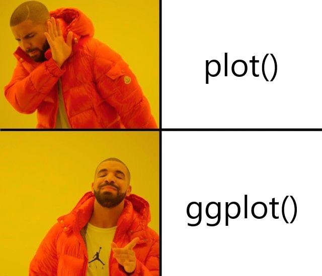

# (PART\*) 第一部分: ggplot2基础 {-}

# 为什么要使用ggplot2 {#chapter-why-ggplot2}

## R画图系统

R有不同的画图系统，比如支持3D的`r CRANpkg("rgl")`包是基于`OpenGL`的，而支持交互的`r CRANpkg("iplots")`包是基于`JavaGD`的，更不要提现在对`Javascript`封装的各种可视化的包，一般我们讲R的画图系统，都特定R本身的画图系统，不包括上面提到的各种封装的包。R的画图系统有两个，base graphics system和grid graphics system，它们对于画图提供底层的支持。R语言可视化的包非常多，能够称之为图形系统的，我认为就只有base和grid，虽然在网上经常看到ggplot2 graphics system这样的说法，但ggplot2是不提供画图底层支持的，它本身是基于grid开发的，我觉得是有必要区分开来，图形系统是base和grid，而lattice和ggplot2这种通用目的的可视化包，称之为可视化系统（visualization system），另外各种各样针对特定做图目的的衍生包称之为图形应用（graphic applications）。

base画图系统是基于S3面向对象来设计的，R的基础数据结构基本上都有`plot()`方法，直接`plot(object)`便可对`object`进行做图，非常方便，要对图像进行注释，比如加拟合的曲线，加文本等，相对于ggplot2等其它软件来说，是以一种非常符合直觉的方式来进行的，这是base系统的好处，另一方面base的代码即使是10年前的，现在也能重复出图，但`ggplot2`就不行了，版本的迭代，有可能使你现在的代码变得不可用，但这种情况发生在base系统的可能性就极低。base画图相当于在一块静态的画布上不断添加素，可以说只给你纸笔但没有橡皮擦，另一方面如果你要设计复杂的图形布局，包括缩放、嵌套图形等，用base就非常困难！

而grid的设计就是为了解决这一问题，一方面graphic object可修改，相当于给了你橡皮擦，另一方面viewports系统，复杂的图形布局轻而易举就可实现，不过你要时刻清楚自己操作的是堆栈中的那一个viewport。grid的学习难度比较大，但它是目前R语言中最灵活、最强大的画图系统。

`r CRANpkg("lattice")`包S-plus中trellis图形系统的R语言实现，基于grid，可以非常方便地应对多重变量的数据可视化，另外`r CRANpkg("vcd")`包也是基于grid系统，它针对的是分类变量的数据可视化，实现了诸如mosaic plot, spine plot, sieve diagram等。这些包虽然没有`ggplot2`受欢迎，但它们的设计简单，方便我们使用grid包对可视化结果修改细节。而`ggplot2`如果主题系统不支持的话，用grid来修改就变得很复杂。

`r CRANpkg("ggplot2")`的优势在于实现了图形语法，让我们以更高的抽象水平来表达图形，画图无非是一个映射过程，而复杂的图通过不同几何对象的图层叠加得以实现，它本身是一门语言，我们通过学习简单的语法就可以拥有强大的表达能力，这是推荐大家学习的理由之一！另外现在`ggplot2`的用户非常多，扩展包也非常多，对于很多特殊领域的应用，有很多扩展包实现，比如说在进化树可视化上我们有`r Biocpkg("ggtree")`包，这也是推荐大家学习的理由，社区的力量非常重要，你面临的问题可能已经有人解决，或者你遇到的困难，有很多人有能力帮你，也乐于帮你，对于学习来说，太重要了。

当然缺点也是有的，正如前面说的，要grid改起来比较麻烦，当然其实会grid的人也不多，别一方面是版本上的不兼容，这在前面也提及到，好在现在的版本已经趋于稳定，应该不会有太大的变动。

## base plot vs ggplot2




# 简介

虽然是简介，但是这里并不想讲一下入门的内容，而是对整个ggplot图形系统的内核做一简单描述。
有些书本上讲到了“图形语法”，却对语法不做说明，让人觉得悬乎其神。事实上，“图形语法”是ggplot最基本和最应该被
理解的部分。有了“图形语法”的认识，你在绘图时才会有的放矢的去找那些需要用到的函数，而不是两眼一抹黑的盲目去试。

简单说来，“图形语法”赋予我们任意指定图形中元素的颜色、形状、大小、透明度等性质，以及字体、标尺、配色等主题属性的能力。

## ggplot图形元素

以一张ggplot图形为例，说明图形中元素的名称即调用函数的方法。

[figure]

- 分面（facet）：`facet_wrap()`, `facet_grid()`;
- 坐标轴（axis）：`scale_x_continous()`,`scale_x_discrete()`,`scale_y_continous()`,`scale_y_discrete()`
- 颜色（color）：`scale_color_continous()`,`scale_color_discrete()`
- 填充（fill）：
- 形状（shape）：
- 分组（group）：
- 大小（size）：
- 透明度（alpha）：

“图形语法”的存在使得我们可以很方便的指定这些元素的的属性，就好像用“语音控制”一样方便：将x轴指定为时间变量（time），
y轴指定为生长（OD600），按照不同菌株（strain）着色，根据处理（treatment）分组（分面）。

```
data <- data.frame(time = c(1:4,1:4,1:4,1:4),
                   OD600 = c(0.15,0.25,0.33,0.44,0.15,0.33,0.50,0.70,0.15,0.27,0.40,0.58,0.15,0.18,0.22,0.30),
				   strain = c("wt","wt","wt","wt","mu","mu","mu","mu","wt","wt","wt","wt","mu","mu","mu","mu"),
				   treatment = c("+","+","+","+","+","+","+","+","-","-","-","-","-","-","-","-"))
ggplot(data,aes(x=time,y=OD600,color=strain))+geom_line()+facet_wrap(~treatment)
```


## 谈一谈映射关系

映射关系通过 `mapping=aes()` 参数指定。ggplot2 会通过分析数值的类型将变量映射成为图形元素的属性。
一般情况下，连续型数值变量会映射为“continous”类型，而文本和因子型变量会映射为“discrete”类型。

## 继承

ggplot是分层绘图，`ggplot()`函数并不绘制任何图形，通常只用来引入绘图数据、创建映射关系等，而具体绘图由
一系列`geom_*`函数完成，常见的有`geom_point()`,`geom_col()`,`geom_boxplot()`,`geom_line()`等。这些绘图函数
默认情况下会继承ggplot对象的数据和映射关系，一层层的叠加在一起，组成一个ggplot完整的图形。

```
ggplot(data,aes(x=time,y=OD600,color=strain))+geom_line()+geom_point()+facet_wrap(~treatment)
```

上图在原有图片上加入了一个点图层，则图形中会出现数据点。

不过，这些绘图函数本身也支持指定数据和映射关系，同时拒绝继承已有的数据和映射关系。通过设置“inherit=FALSE”即可。

拒绝继承大大增加了数据的操作空间。例如当我们需要把原始数据、平均值、标准差和统计检验显著性水平等绘制在一起时，
通常会用到这一特性。

```
# example

```

